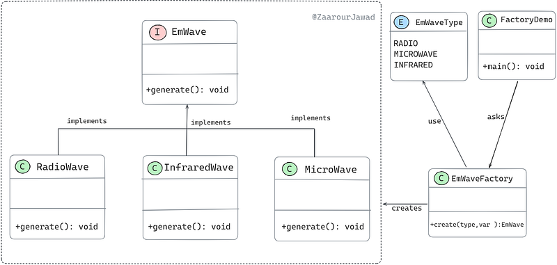

# Using Lambda Expressions to Enhance the Factory Pattern in Java
This project demonstrates the implementation of the Factory Pattern in Java using lambda expressions.

You may find further information [on my medium blog.](https://medium.com/@zjawad333/using-lambda-expressions-to-enhance-the-factory-pattern-in-java-d578a06bbba2)

## Code Structure

